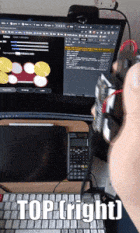

# Virtual Drum
Arduino Nano 33 BLE + web app implementation that plays drum sounds based on recognized hand gesture.

This project highlighted on deploying a machine learning model directly on a resource-constrained environment, particularly an Arduino Nano 33 BLE board. It demonstrated the possibility of combining machine learning technique with an embedded system by giving precedence to embedded system performance while concurrently optimizing the model to align with this specific use case.

This project was developed as part of the coursework for NTU's CE4172 Internet of Things: Tiny Machine Learning.

## Demo (watch on YouTube)

## Overview
There are 4 gesture available for each hand(left/right)

Gesture for left hand are shown below

Gesture for right hand are basically mirroring the same gesture of left hands:

## Hardware & Software used
A simple block diagram of the setup

### Hardware
- 2x Arduino Nano 33 BLE/Arduino Nano 33 BLE Sense board
- 2x 9v Lithium batteries
- 2x battery holders
- a computer to run the drum web app

### Software
- Arduino IDE
- A [web application](https://wxchee.github.io/demo/tinyml/webapp/index.html) made with Vue.js

## Try it yourself

Step 1: Uploads the sketch file + model header file to your Arduino Nano 33 BLE board.

Sketch file + trained model header file:
- [left hand](sketch/left/)
- [right hand](sketch/right/)

Step 2: Visits the [web application](https://wxchee.github.io/demo/tinyml/webapp/index.html)

Step 3: Power up the board, connect the board to the web app via the "Add peripheral" button on the top left corner of the screen (see below video)

https://github.com/wxchee/CE4172-project/assets/33355985/f5cb36b8-b456-4b26-85bc-45a406192109

Step 4: Performs any of the gesture as stated under the Overview to play drum sound.

# Development
An ideal threshold is determined to allow data sampling session to be triggered without the system being too sensitive to any movement.

Also, a minimal system response time is determined via empirical tests:

Upon tests, threshold value of `0.16` and the goal response time `150 millisecond` are chosen.

## Data collection
Eight set of gesture datas are collected with each stores 40 captures. Each capture consists of 15 samples, with each sample holding six values covering 3-axis gyroscope and accelerometer’s data, which made input size to be a total of 90. An example of a single capture data is shown below:

## Model training
Two separate models have been trained with each specifically represents left and right hand gestures respectively, instead of utilizing a single model to distinguish among all eight gestures. This strategy helps to simplify the model complexity, which not only contribute to the inference speed, but also reduce the model file size, presenting a more suitable approach for a resource constraint environment such as an Arduino board.

An initial setup of model configuration below yields good inference accuracy:

Despite the good inference accuracy, an input size of 180 shows significant delay in data sampling time(~246ms). The system response time is mainly dominated by data sampling time. Therefore, input size needs to be reduced further.

Beside input size, further tests are also conducted to reduce model complexity(neurons count per layer) while maintaining optimal inference performance.

Upon tests, it is deemed that an input size of 90, a model featuring 32 neurons in the first layer, and 16 neurons in the second layer helps to reduce both data sampling and inference times while showing no significant reduction in inference accuracy. This setup also ensures that the response time remains within 150ms, which satisfies the goal response time.

Below is the final model training configuration:

Below depicts the final model performance:

 

The model yields a good prediction accuracy on test data.

The model is then converted into a header file format that can be imported into the Arduino executable.

## Web Application
Web application dev directory: [drum-webapp](drum-webapp/)
 - an interface to play drum sound, establish bluetooth connection with Arduino board
 - receive gesture inference result from Arduino board, play drum sound based on the result
 - Data collection
   - initiate a data sampling session, receive bulk response of collected gesture data from Arduino board
   - convert collected gesture data into csv format for download

